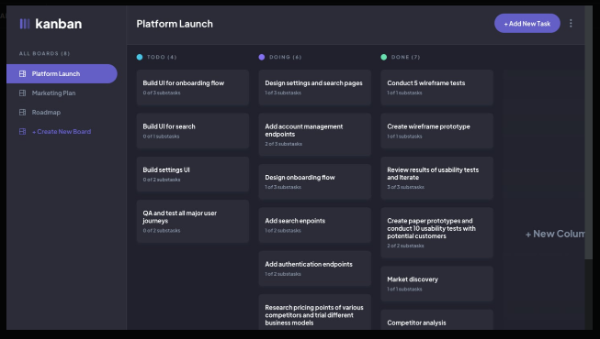

<h1> Kanban Task Management Web App </h1>

This web app is a Kanban-style task management tool designed to help you keep track of your work.

## Features

- Create, read, update, and delete boards and tasks.
- Organize tasks into columns to track their status.
- Mark subtasks as complete.
- Toggle between light and dark themes for comfortable usage.
- Enjoy a responsive design for various device screen sizes.
- Hover over interactive elements for a user-friendly experience.
- Drag and drop tasks to change their status and reorder them in a column.
- Changes are saved even after refreshing the browser, making it convenient for tracking tasks over time.



### Website : https://kanbannapp.netlify.app/  ###

## Built with

- [React](https://react.dev/) - A JavaScript library that allows you to create user interfaces.
- [TypeScript](https://www.typescriptlang.org/) -  A strongly typed programming language that builds on JavaScript.
- [Tailwind-css](https://tailwindcss.com/) - A utility-first CSS framework.
- [React-Router](https://reactrouter.com/en/main) - A tool that allows you to create routes, navigation, and page-switching in your React web applications.
- [Firebase](https://firebase.google.com/) - 
- [Vite](https://vitejs.dev/) - A tool that is used for building fast and optimized web applications. 
- [Cypress](https://www.cypress.io/) - With Cypress, you can easily create tests for your modern web applications and debug them visually. 


## Installation

- Clone the repository

```sh
git clone https://github.com/arr199/Task-management-app
```

- Install dependencies

```sh
npm install
```

- Run server

```sh
 npm run dev
```
